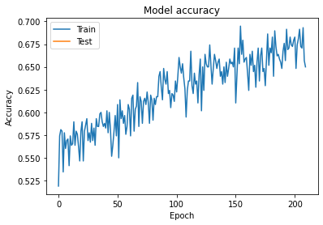
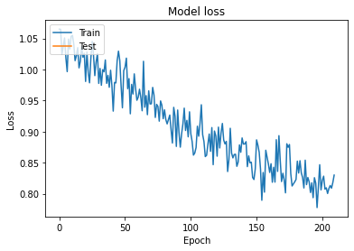
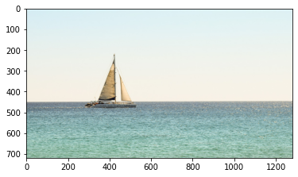
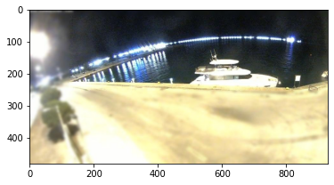
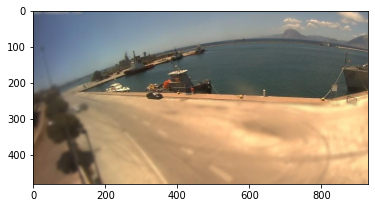
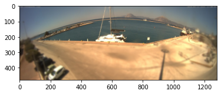

# 🚤 Boat Type Classification (CNN)

> A TensorFlow / Keras Convolutional Neural Network that classifies marine vessels by type from a single image.


---

## Overview

This project trains a Convolutional Neural Network (CNN) to recognise the **type** of a
boat from a photograph. The model is built from scratch in **Keras** and trained on a
**custom dataset** of harbour and coastal imagery, then exercised on additional examples
drawn from the public **Kaggle "Boats" dataset**.

Given a single `100 × 100` RGB image, the network outputs a probability distribution over
five vessel categories and returns the most likely class.

- **Task:** multi-class image classification (5 classes)
- **Framework:** TensorFlow / Keras (`Sequential` API)
- **Input:** RGB images resized to `100 × 100`, pixel values scaled to `[0, 1]`
- **Training data:** 580 images (training split) + 141 images (validation split) across 5 classes
- **Augmentation:** rotation, width/height shift, shear, zoom and horizontal flip

## 🏷️ Boat classes

The model predicts one of the following five categories (label index → class):

| Index | Class       |
|:-----:|:------------|
| 0     | Catamaran   |
| 1     | No ship     |
| 2     | Sailboat    |
| 3     | Ship        |
| 4     | Yacht       |

> The `No ship` class lets the network reject scenes that contain no vessel, rather than
> being forced to guess a boat type.

## 📊 Results

The model was trained for **210 epochs** using the Adam optimiser and categorical
cross-entropy loss. Training accuracy climbed steadily to a best of **~0.69 (69.5%)**, with
the loss curve falling from ~1.05 to ~0.80 over the run.

<table>
  <tr>
    <td align="center"><b>Training accuracy</b></td>
    <td align="center"><b>Training loss</b></td>
  </tr>
  <tr>
    <td></td>
    <td></td>
  </tr>
</table>

> **Note on metrics:** the figures above are the actual values printed by the training run
> in the notebook (best training accuracy `0.69483`; validation accuracy around `0.65`).
> This is a compact, from-scratch CNN trained on a small custom dataset, so the numbers
> reflect that scale rather than a large pre-trained backbone.

## 🖼️ Sample predictions

A selection of model predictions on held-out images. The custom-dataset samples are wide
coastal panoramas; the sailboat example is taken from the Kaggle Boats dataset.

<table>
  <tr>
    <td align="center"><br><b>Predicted: Sailboat</b></td>
    <td align="center"><br><b>Predicted: Yacht</b></td>
  </tr>
  <tr>
    <td align="center"><br><b>Predicted: Ship</b></td>
    <td align="center"><br><b>Predicted: Catamaran</b></td>
  </tr>
</table>

## 🧠 How it works

The classifier is a small CNN: two convolution + max-pooling blocks act as a feature
extractor, followed by a dense head with dropout for regularisation and a 5-way softmax
output. Images are normalised to `[0, 1]` and augmented on the fly during training with the
Keras `ImageDataGenerator`.

```python
from keras.models import Sequential
from keras.layers import Conv2D, MaxPooling2D, Dropout, Flatten, Dense

model = Sequential()
model.add(Conv2D(32, kernel_size=(3, 3), activation='relu', input_shape=(100, 100, 3)))
model.add(MaxPooling2D(pool_size=(2, 2)))
model.add(Conv2D(64, (3, 3), activation='relu'))
model.add(MaxPooling2D(pool_size=(2, 2)))
model.add(Dropout(0.25))
model.add(Flatten())
model.add(Dense(128, activation='relu'))
model.add(Dropout(0.5))
model.add(Dense(5, activation='softmax'))

model.compile(loss='categorical_crossentropy', optimizer='adam', metrics=['acc'])
```

The compiled model has **4,353,733 trainable parameters**. After training, the best weights
are checkpointed and reloaded to run inference on new images, mapping the predicted index
back to a human-readable class name.

## 📦 Dataset

- **Custom dataset** — coastal / harbour imagery organised into five class folders
  (`catamaran`, `no_Ship`, `sailboat`, `ship`, `yacht`). An 80 / 20 split is created at
  load time via `validation_split=0.2` (580 training images, 141 validation images).
- **Kaggle "Boats" dataset** — used for additional benchmark examples; see
  [Boat types recognition on Kaggle](https://www.kaggle.com/datasets/clorichel/boat-types-recognition).

> Datasets are **not** committed to this repository. Place your images locally under a
> `datasets/` folder (git-ignored) and point the data directory in the notebook at it.

## 🗂️ Repository structure

```
.
├── boat_Classes.ipynb     # End-to-end notebook: data loading, model, training, inference
├── assets/                # Curated figures used in this README
│   ├── training_accuracy.png
│   ├── training_loss.png
│   ├── sample_prediction_sailboat.png
│   ├── sample_prediction_yacht.png
│   ├── sample_prediction_ship.png
│   └── sample_prediction_catamaran.png
├── requirements.txt       # Python dependencies
├── LICENSE                # MIT license
└── README.md
```

## 🧰 Tech stack

**Python** · **TensorFlow** · **Keras** · **NumPy** · **Matplotlib**

## 📝 License

Released under the [MIT License](LICENSE).

---

**Author:** Andreas Neofytou — [LinkedIn](https://www.linkedin.com/in/andreas-neofytou-283103198) · [GitHub](https://github.com/andreasN78)
